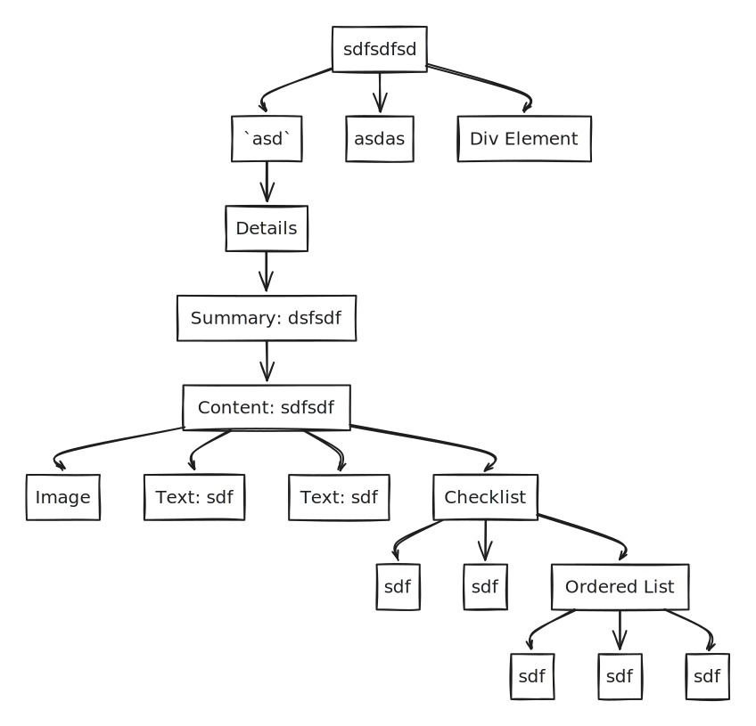

# 😃 Page

$$f(x) = x * e^{2 pi i \xi x}$$

<table><thead><tr><th width="236" data-type="rating" data-max="5">sdfsdf</th><th width="40"></th><th width="40"></th><th data-type="rating" data-max="5"></th><th data-type="content-ref"></th><th><select multiple></select></th><th data-type="number"></th><th data-hidden>sdfsd</th><th data-hidden>sdfsdf</th></tr></thead><tbody><tr><td>null</td><td></td><td></td><td>2</td><td></td><td></td><td>null</td><td></td><td></td></tr><tr><td>null</td><td></td><td></td><td>3</td><td></td><td></td><td>null</td><td></td><td></td></tr><tr><td>null</td><td></td><td></td><td>4</td><td></td><td></td><td>null</td><td></td><td></td></tr></tbody></table>

#### adsfsfsd



```javascript
const message = "hello world";
console.log(message);
```



```python
message = "hello world"
print(message)
```



```ruby
message = "hello world"
puts message
```



<table data-view="cards"><thead><tr><th></th><th></th><th></th></tr></thead><tbody><tr><td></td><td></td><td></td></tr><tr><td></td><td></td><td></td></tr><tr><td></td><td></td><td></td></tr></tbody></table>





###





###





###






sdfsdfsd

* `asd`
* asdas
* `<div>asd</div>`


<details>

<summary>dsfsdf</summary>

sdfsdf


sdf

sdf


***

* [ ] sdf
* [ ] sdf
*
[ ]   1. sdf
  2. sdf
  3. sdf

</details>

asdasd

> asdasdasdasf asf as
>
> * [ ] asd
> * [ ] asd
> * [ ] ~~asdqweqw~~
> * [ ] asd
> * [ ] asd
>
>

dfgdfgdf

<mark style="color:blue;">`GET`</mark>&#x20;







ddfgdf





fdgdfgdf

[_asdadsasda_](#user-content-fn-1)[^1]


[^1]: this is annotation

